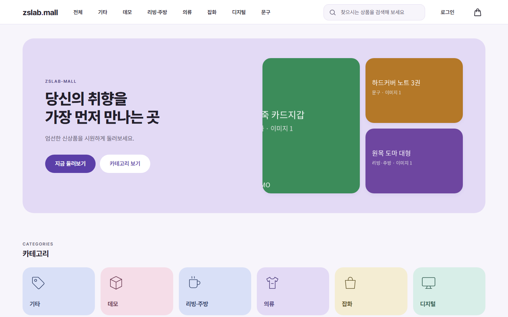
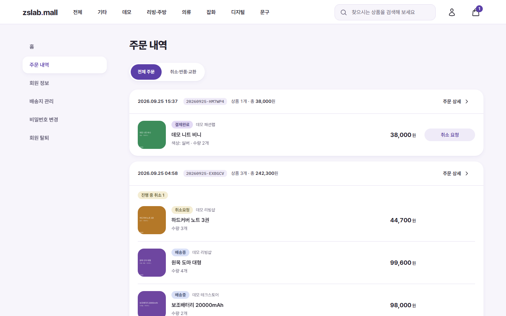
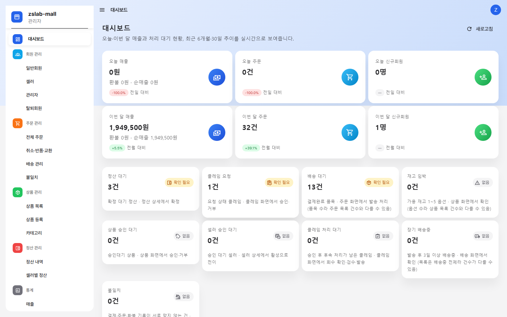
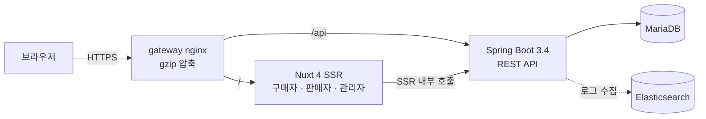
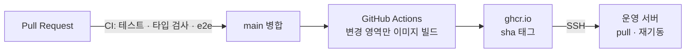
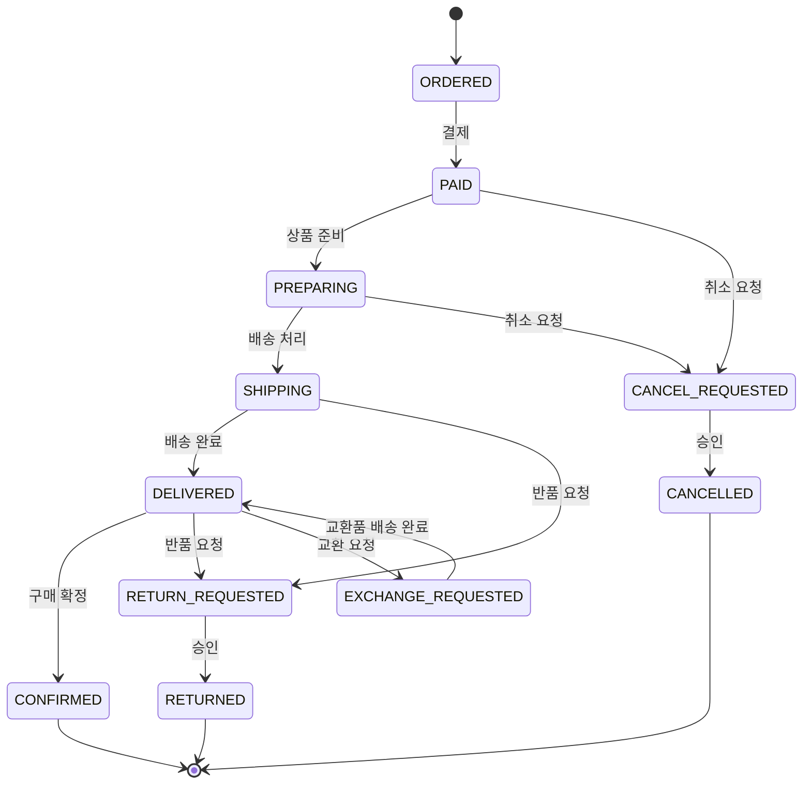

# zslab.mall

**혼자 설계하고 실제로 운영하는 멀티벤더 쇼핑몰** — 상품 탐색부터 주문·결제·배송·취소/반품/교환·환불·판매자 정산까지, 쇼핑몰의 전체 흐름을 직접 만들고 운영합니다.

🔗 **라이브 데모: https://zslab-mall.duckdns.org**

| 구매자 메인 | 주문 내역 | 관리자 |
|---|---|---|
|  |  |  |

---

## 이 프로젝트가 보여 주는 것

- **처음부터 끝까지 혼자 완성합니다.** 기획·설계·개발·배포·운영을 한 사람이 맡아, 구매자·판매자·관리자 세 역할이 실제로 쓰는 서비스를 만들었습니다.
- **문제를 원인까지 추적해 고칩니다.** 운영 중 관리자 배송 처리가 한 번 실패한 일이 있었습니다. 로그와 데이터로 원인을 좁혀 보니 단순 입력 실수가 아니라 "송장번호는 겹치면 안 된다"는 설계 가정 자체가 실제 택배 업무(여러 상품을 한 상자에 보내는 합포장)와 맞지 않는 문제였고, 설계를 고쳐 해결했습니다.
- **모든 판단에 근거를 남기고, 위험한 변경은 반드시 한 번 더 검토받습니다.** 중요한 결정마다 검토한 대안과 채택·기각 이유를 기록하고, 돈·재고·데이터를 건드리는 변경은 만든 사람이 아닌 검토자의 확인을 거친 뒤에만 반영합니다.

## 숫자로 보기

| | |
|---|---|
| 자동 테스트 | **2,500개 이상** — 코드를 바꿀 때마다 자동으로 검증 |
| 판단 기록 | **300건 이상** — 대안과 선택 이유까지 기록 |
| 사용자 역할 | **3개** — 구매자 · 판매자 · 관리자 |
| 화면 품질 | 구매자 화면 6개 항목 채점 **95.8점** (디자인·일관성·직관성·편의성·접근성·성능) |
| 배포 | 실제 도메인 · 보안 연결(HTTPS) · 자동 배포 |

## 직접 써 보기

로그인 화면의 **데모 로그인 버튼**으로 가입 없이 바로 둘러볼 수 있습니다.

| 역할 | 주소 | 둘러볼 곳 |
|---|---|---|
| 구매자 | [/login](https://zslab-mall.duckdns.org/login) — "데모 계정으로 둘러보기" | 상품 담기 → 주문·결제 → 주문 내역 → 취소·반품·교환 신청 |
| 판매자 | [/seller/login](https://zslab-mall.duckdns.org/seller/login) — "셀러 데모 로그인" | 주문 → 배송 처리 → 클레임 → 상품·재고 → 매출·통계 → 정산 |
| 관리자 | [/admin/login](https://zslab-mall.duckdns.org/admin/login) — "관리자 데모 로그인" | 전체 주문·취소·반품·교환 → 회원 → 상품·카테고리 → 정산 → 통계 |

> 결제는 실제 카드사 연동 대신 **모의 결제**로 동작합니다. 실제 돈은 오가지 않습니다.

> 설계와 판단은 직접 하고, 구현은 AI 코딩 에이전트와 협업했습니다. 협업 방식은 [개발 방식](#개발-방식)에 적어 두었습니다.

---
---

# 개발자를 위한 상세

**목차**
[아키텍처](#아키텍처) · [도메인 설계](#도메인-설계) · [핵심 설계 결정](#핵심-설계-결정) · [테스트와 품질](#테스트와-품질) · [운영과 배포](#운영과-배포) · [개발 방식](#개발-방식) · [기술 스택](#기술-스택) · [로컬 실행](#로컬-실행) · [한계와 다음 계획](#한계와-다음-계획) · [문서](#문서)

## 아키텍처

### 요청 흐름



- 하나의 Nuxt 앱 안에서 구매자 화면(`app/`)과 관리자·판매자 화면(Nuxt Layer `layers/admin`, `layers/seller`)을 분리했습니다.
- 게이트웨이가 경로로 프론트엔드와 API를 나누고, 여러 프로젝트가 공유하는 인프라(DB·로그 수집) 위에서 동작합니다.

### 배포 흐름



- 테스트 게이트는 PR CI에 두고, 이미지 빌드는 테스트를 다시 돌리지 않습니다.
- 롤백은 서버의 이미지 태그를 이전 커밋 태그로 바꾸는 것으로 끝납니다.

## 도메인 설계

- 백엔드는 DDD로 **16개 애그리거트**를 나눴습니다. 경계는 "함께 생성되는가 · 함께 삭제되는가 · 같은 트랜잭션에서 바뀌는가 · 독립적으로 수정될 수 없는가" 네 기준으로 정했습니다([애그리거트 경계](docs/architecture-baseline/aggregate-boundary.md)).
- 주문은 **주문(Order) — 주문 품목(OrderItem)** 두 층으로 상태를 가집니다. 한 주문 안에서도 품목마다 배송·취소 상태가 다를 수 있기 때문입니다.
  - 주문 단위 상태는 결제 대기(`PENDING_PAYMENT`)에서 시작하고, 부분 취소(`PARTIAL_CANCEL`)와 결제 만료(`PAYMENT_EXPIRED`)를 따로 가집니다.
  - 품목 단위 상태와 허용 전이는 아래와 같습니다.



- 요청이 거부되면 요청 직전 상태로 돌아갑니다. 결제 없이 끝난 주문의 품목은 `ORDERED`로 남습니다.

## 핵심 설계 결정

각 결정은 [결정 기록](docs/architecture-baseline/decisions.md)에 대안과 기각 근거까지 남아 있습니다.

### 1. 주문 종결 모델: 결제 만료는 취소가 아니고, 재고는 주문을 따른다 (D-153)
- **문제:** 결제를 끝내지 않고 떠난 주문을 "취소"로 처리하면, 결제 후 사용자가 직접 요청한 취소와 환불·통계 흐름에서 섞입니다. 재고 복원을 결제 실패 이벤트에 묶으면 재시도·만료·취소 경로마다 복원 시점이 흩어집니다.
- **결정:** 미결제 종료는 `PAYMENT_EXPIRED`, 취소는 결제 후 사용자 클레임에만 씁니다. 재고 차감·복원은 결제 이벤트가 아니라 **주문 생명주기**에 묶었습니다.
- **효과:** 환불 대상과 이탈 주문이 상태만으로 구분되고, 재고 변화가 한 곳의 전이 규칙으로 설명됩니다.

### 2. 재고 동시성: 비관적 락과 락 순서 (D-167)
- **문제:** 같은 상품을 동시에 주문하면 재고가 음수가 되거나, 여러 옵션을 한 번에 주문할 때 교착이 생길 수 있습니다.
- **검토:** 조건부 UPDATE로 재고를 차감하는 방식을 비교한 뒤 기각했습니다(D-167). 낙관적 락(@Version)은 재고가 아니라 주문 쪽에서 검토해 기각했습니다.
- **결정:** 재고 행을 `PESSIMISTIC_WRITE`로 잠그고, 여러 옵션은 **옵션 id 오름차순**으로 잠가 교착을 막습니다. DB의 `CHECK (재고 >= 0)` 제약을 최종 방어선으로 둡니다. 조건부 UPDATE는 재고가 아니라 주문 상태 전이에만 씁니다.

### 3. 품목 단위 상태 모델과 "요약 = 목록" 기준 일치 (D-223 · D-224)
- **문제:** 마이페이지 주문 현황은 품목 상태로 세는데, 주문 목록은 주문 단위라 숫자를 눌러 들어가면 기대와 다른 목록이 나왔습니다.
- **선택지:** 필터 없이 이동 / 주문 상태 필터 / **품목 상태 필터(채택)**
- **결정:** 목록 API에 품목 상태 필터를 추가하고, 요약과 같은 상태 집합·같은 기간 계산을 **한 곳에서 공유**했습니다. 해당 품목이 있는 주문을 `EXISTS`로 고르고, 조회용 복합 인덱스를 추가했습니다.
- **검증:** 요약 단계별 수와 필터 결과를 교차 확인하는 통합 테스트.

### 4. 운영 사건에서 도메인을 다시 읽다: 송장번호 유니크 제거 (D-227)
- **사건:** 관리자 배송 처리가 HTTP 500으로 한 번 실패했습니다. 로그·데이터 조사 결과 데이터 손상은 없었고, 입력한 송장번호가 다른 주문의 값과 겹쳐 전역 유니크 제약에 걸린 것이었습니다.
- **재해석:** 배송 행은 **주문 품목 단위**입니다. 여러 품목을 한 상자에 보내면(합포장) 송장번호가 같아야 정상이고, 택배사는 번호를 재사용합니다. 전역 유니크는 막아야 할 것은 거의 막지 못하고 정상 업무를 막는 제약이었습니다.
- **결정:** 유니크를 일반 인덱스로 바꾸고(이전 결정 D-184의 "중복 금지" 규칙을 대체), 대신 송장 입력 5개 경로 전부에 **형식 검증**(영문·숫자·하이픈 8~20자)과 **명확한 오류 응답**을 추가했습니다.

### 5. 역할별로 독립된 로그인 세션
- 구매자·판매자·관리자 세션을 프론트엔드에서 역할별 저장소와 쿠키(경로 `/`, `/seller`, `/admin`)로 나눠 관리합니다. 각 로그인 화면은 자기 역할만 받고, 관리자로 로그인한 채 구매자·판매자 화면을 함께 확인할 수 있습니다.
- 백엔드는 역할과 무관하게 Bearer 토큰 하나로 인증하고, 권한은 토큰의 역할로 판단합니다.

### 6. 외부 연동은 모의(Mock) 경계 뒤에 두고 교체 지점을 준비
- 결제(`PaymentGateway`)·SMS(`SmsSender`)·메일(`NotificationSender`)·배송 조회(`DeliveryTracker`)를 포트 인터페이스로 두고, 설정 키(`zslab.payment.gateway` 등)로 구현체를 고릅니다. 기본값은 모두 `mock`입니다.
- 실제 구현체 없이 `mock` 외 값을 넣으면 주입할 구현체가 없어 기동에 실패하도록 설계되어 있습니다(조용한 모의 구현 폴백 없음).
- 실제 운영 전환 절차는 [실서비스 전환 가이드](docs/architecture-baseline/real-service-switch-guide.md)에 있습니다.

## 테스트와 품질

| 구분 | 수 | 도구 |
|---|---|---|
| 백엔드 | 1,620 | JUnit · Spring Boot Test (통합 테스트 중심) |
| 프론트엔드 단위·컴포넌트 | 849 | Vitest |
| e2e | 115 (35개 spec) | Playwright |

- **쿼리 수 예산 테스트:** 목록 API가 데이터 건수와 관계없이 고정된 쿼리 수로 동작하는지(N+1 방지) 테스트로 고정합니다.
- **위험도별 외부 검토:** 돈·재고·상태 전이·마이그레이션·보안 변경은 외부 검토 없이 병합하지 않습니다. 자세한 기준은 [개발 방식](#위험도별-외부-검토)에 있습니다.
- **화면도 채점합니다:** 구매자 화면을 6개 항목(디자인·일관성·직관성·편의성·접근성·성능)으로 채점하고, 목표(평균 95)에 못 미치는 항목만 보완했습니다. 기준선 76.4(성능 제외 5개 항목) → 1차 측정 86.2 → 최종 95.8(6개 항목). 성능은 Lighthouse 모바일 측정으로 재고, 게이트웨이 응답 압축 하나로 성능 71 → 87을 얻었습니다.

## 운영과 배포

- Docker 이미지 · GitHub Actions · ghcr.io · SSH 배포
- 변경된 영역(백엔드/프론트엔드)만 빌드, 빌드 캐시는 서비스별 분리
- 이미지 태그 `sha-<7자>` + `latest`, 최근 5개 버전 유지, 배포는 직렬 실행
- 하루 1회 주문·결제 불일치를 찾아 관리자 목록에 기록하는 점검 스케줄러(업무 데이터는 바꾸지 않음)
- 운영 문서: [배포 런북](docs/architecture-baseline/deploy-runbook.md)

## 개발 방식

**정찰 → 결정 → 구현 → 검증 → 검토**를 한 사이클로 돕니다.

1. **정찰:** 코드를 읽기만 하고 사실을 파일·줄 근거와 함께 정리합니다.
2. **결정:** 선택지가 있으면 대안마다 채택·기각 이유를 적고 결정 번호(D-XX, FE-XX)로 기록합니다. 결정 기록은 덧붙이기만 하는 단일 원천입니다.
3. **구현·검증:** 목표 달성에 필요한 변경만 하고, 테스트와 화면 캡처로 확인합니다.
4. **검토:** 변경의 위험도에 따라 검토 수준을 정합니다(아래).

### 위험도별 외부 검토

만든 사람이 스스로 검토하면 놓치는 것이 생깁니다. 그래서 변경마다 정찰 단계에서 등급을 매기고, 등급에 따라 **작성 주체와 다른 검토자**의 검토를 거칩니다. 구현은 Claude 기반 에이전트가 하므로, 외부 검토는 **다른 회사의 모델인 OpenAI ChatGPT**에 맡깁니다. 같은 모델이 공유하는 편향과 사각지대를 피하기 위해서입니다.

| 등급 | 대상 | 검토 |
|---|---|---|
| **A (필수)** | 돈(결제·환불·정산·금액 계산) · 재고·동시성(락·트랜잭션 경계) · 상태 전이 · 데이터 마이그레이션·운영 데이터 보정 · 인증·권한·파일·웹훅 · 운영 데이터를 바꾸는 배치 | 외부 검토 없이 병합 금지 |
| **B (선택)** | 조회 API·응답 필드 추가 · 추가형 스키마(nullable 컬럼·인덱스) · 실패해도 본 처리에 영향 없는 부가 기능 | 필요 여부를 판단해 기록 |
| **C (생략)** | 화면 전용 · 문서 · CI·인프라 설정 · 테스트만 변경 | 생략 |

- **검토 전 셀프 리뷰:** A·B 등급은 구현 직후 별도 검토 에이전트가 먼저 확인하고, 지적마다 수용·기각을 근거 한 줄과 함께 판정합니다. A 등급은 셀프 리뷰로 외부 검토를 대신할 수 없습니다.
- **검토 요청도 구조화:** 범위(커밋·파일), 관련 결정 요약, 집중 질문 3~7개를 담아 요청합니다.
- **지적 처리:** 항목마다 수용 또는 기각(근거 1줄)으로 판정하고, 수용한 것은 같은 브랜치에서 반영한 뒤 병합합니다.
- **재검토 기준:** 반영이 설계 변경(새 구조·트랜잭션 경계 이동)이면 1회 재검토합니다. 국소 수정이면 지적된 시나리오를 테스트로 재현·통과시키는 것으로 끝냅니다(연속 재검토는 최대 2회).
- **기록:** 결정마다 "외부 검토: 등급 / 지적 N건 중 수용 N건"을 남깁니다. B 등급을 생략했다면 그 근거도 적습니다.

**AI 협업:** 설계·결정·검토는 직접 하고, 코드 작성과 정찰은 AI 코딩 에이전트(Claude Code)에 위임했습니다. 에이전트가 판단이 갈리는 지점을 만나면 멈추고 선택지를 보고하게 했고, 채택 여부는 제가 결정했습니다. 그 판단의 흔적이 결정 기록 전체입니다.

## 기술 스택

| 영역 | 기술 |
|---|---|
| 백엔드 | Java 21 · Spring Boot 3.4.1 · Gradle · Hibernate 6.6 · Flyway 10 (Hibernate·Flyway는 Boot BOM 기준) |
| 프론트엔드 | Nuxt 4.4 (SSR) · Vue 3.5 · TypeScript 6.0 · Tailwind CSS 4.3 · reka-ui 2.10 · Vuetify 3.13(관리자·판매자) |
| 데이터 | MariaDB |
| 테스트 | JUnit · Vitest · Playwright |
| 인프라 | Docker · GitHub Actions · ghcr.io · nginx · Filebeat · Elasticsearch |

## 로컬 실행

이 프로젝트는 여러 프로젝트가 함께 쓰는 **공유 인프라(MariaDB 등 컨테이너와 공용 네트워크)** 위에서 동작합니다. 공유 인프라를 먼저 띄운 뒤 아래 순서로 실행합니다.

```bash
# 1. 환경 변수
cp .env.example .env        # 값 채우기(설명은 파일 주석 참고)

# 2. 로컬 도메인·인증서: hosts에 로컬 도메인 등록, mkcert로 인증서 발급

# 3. 기동 (운영 기본 파일 + 로컬 전용 오버라이드)
docker compose -f docker-compose.mall.yml -f docker-compose.dev.yml up -d

# 4. 테스트
cd backend && ./gradlew test          # 백엔드
# 프론트엔드는 frontend 컨테이너 안에서 pnpm vitest run · pnpm typecheck
```

## 한계와 다음 계획

- **외부 연동:** 실제 PG·SMS·메일은 연동하지 않았습니다(모의 경계). 비밀번호 찾기는 준비 중입니다. 파일 저장은 아직 모의 경계 없이 서버 디스크를 씁니다.
- **성능:** 모바일 첫 화면 기준 추가 개선 여지(JS 분할·렌더 차단 CSS·폰트 전송량)가 남아 있습니다.
- **다음 기능:** 리뷰 · 찜 · 알림함 · 재입고 알림 · 상품 Q&A · 1:1 문의
- **운영 구조:** 관리자 조치 감사 로그, 관리자 콘텐츠 편집, 클레임 처리 제안 자동화

## 문서

- [결정 기록 — 백엔드](docs/architecture-baseline/decisions.md)
- [결정 기록 — 프론트엔드](docs/architecture-baseline/decisions-fe.md)
- [도메인 불변식](docs/architecture-baseline/invariants.md)
- [배포 런북](docs/architecture-baseline/deploy-runbook.md)
- [실서비스 전환 가이드](docs/architecture-baseline/real-service-switch-guide.md)
