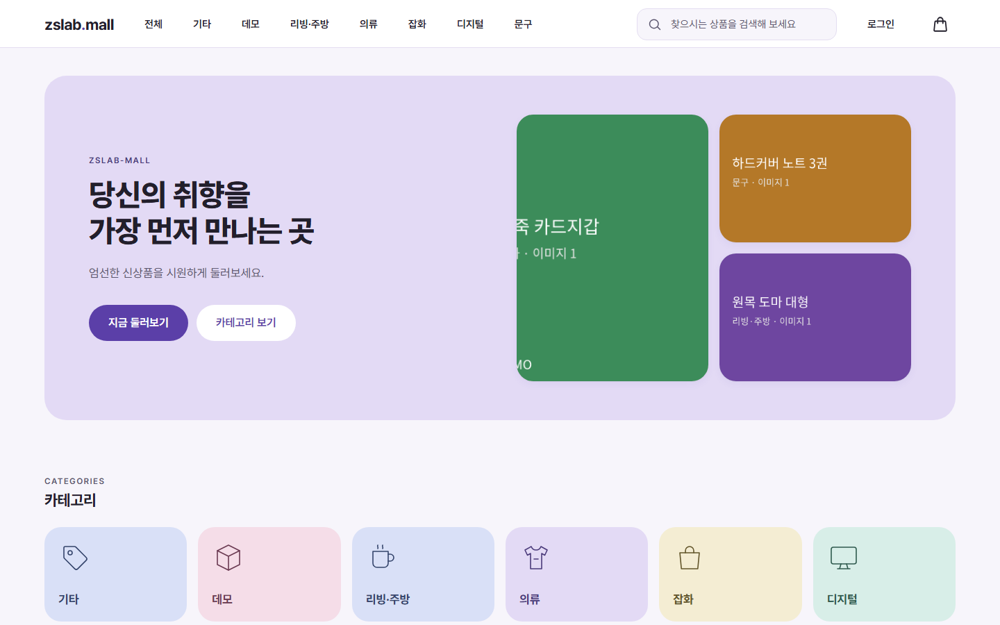
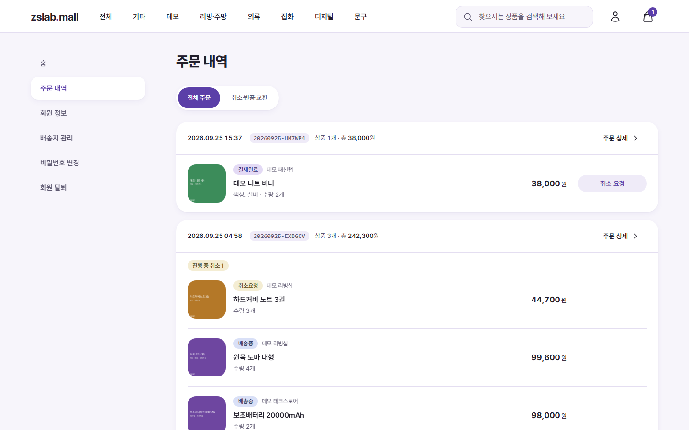
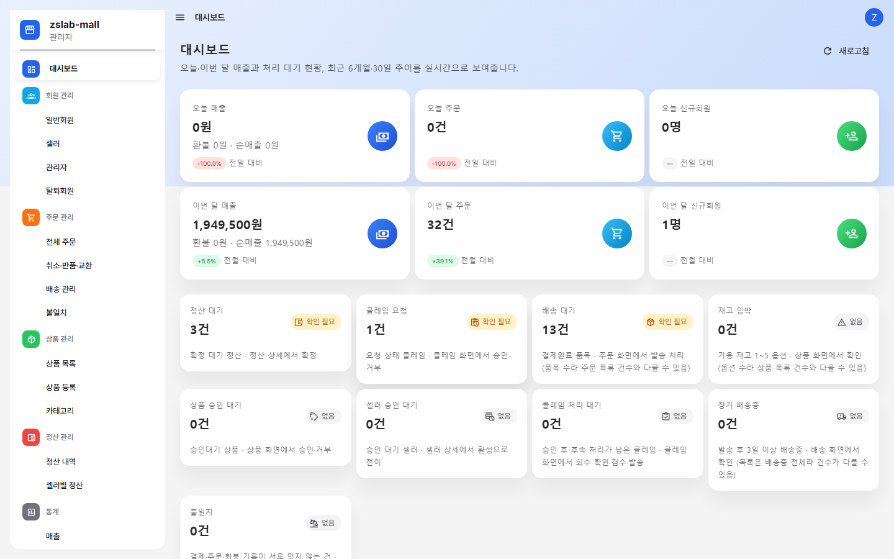
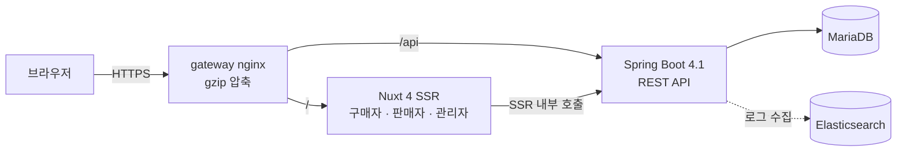
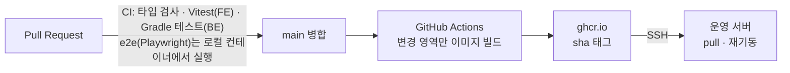
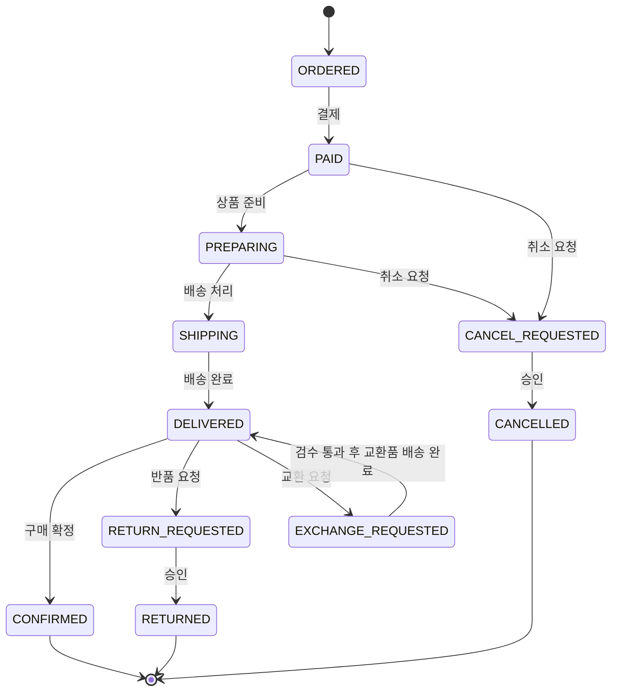

# zslab.mall

**혼자 설계하고 실제로 운영하는 멀티벤더 쇼핑몰** — 상품 탐색부터 주문·결제·배송·취소/반품/교환·환불·판매자 정산까지, 쇼핑몰의 전체 흐름을 직접 만들고 운영합니다.

🔗 **라이브 데모: https://zslab-mall.duckdns.org**

| 구매자 메인 | 주문 내역 | 관리자 |
|---|---|---|
|  |  |  |

---

## 이 프로젝트가 보여 주는 것

- **처음부터 끝까지 혼자 완성합니다.** 기획·설계·개발·배포·운영을 한 사람이 맡아, 구매자·판매자·관리자 세 역할이 실제로 쓰는 서비스를 만들었습니다.
- **문제를 원인까지 추적해 고칩니다.** 운영 중 관리자 배송 처리가 한 번 실패한 일이 있었습니다. 로그와 데이터로 원인을 좁혀 보니 단순 입력 실수가 아니라 "송장번호는 겹치면 안 된다"는 설계 가정 자체가 실제 택배 업무(여러 상품을 한 상자에 보내는 합포장)와 맞지 않는 문제였고, 설계를 고쳐 해결했습니다.
- **판단에 근거를 남기고, 위험한 변경은 반드시 한 번 더 검토받습니다.** 중요한 결정마다 검토한 대안과 채택·기각 이유를 기록합니다. 돈·재고·상태기계·데이터·보안·스케줄러처럼 위험도가 높은 변경은, 구현한 AI 에이전트와 다른 회사의 AI 모델로 교차 검토를 거친 뒤에만 반영합니다.

## 숫자로 보기

| | |
|---|---|
| 자동 테스트 | **3,000개 이상** — 코드를 바꿀 때마다 자동으로 검증 |
| 판단 기록 | **300건 이상** — 선택지가 있던 결정은 대안과 선택 이유까지 기록 |
| 사용자 역할 | **3개** — 구매자 · 판매자 · 관리자 |
| 화면 품질 | 구매자 화면 자체 채점 **95.8점** (6개 항목 기준표: 디자인·일관성·직관성·편의성·접근성·성능) |
| 배포 | 실제 도메인 · 보안 연결(HTTPS) · 자동 배포 |

## 직접 써 보기

로그인 화면의 **데모 로그인 버튼**으로 가입 없이 바로 둘러볼 수 있습니다.
3역할로 가입부터 정산까지 이어 보는 순서는 [시연 시나리오](docs/demo-scenario.md)에 정리했습니다.
판매자·관리자 업무 매뉴얼은 각 화면 상단 계정 메뉴의 **도움말**에서 볼 수 있습니다.

| 역할 | 주소 | 둘러볼 곳 |
|---|---|---|
| 구매자 | [/login](https://zslab-mall.duckdns.org/login) — "데모 계정으로 둘러보기" | 상품 담기 → 주문·결제 → 주문 내역 → 취소·반품·교환 신청 |
| 판매자 | [/seller/login](https://zslab-mall.duckdns.org/seller/login) — "셀러 데모 로그인" | 운영 인박스 → 주문 → 배송 처리 → 클레임 → 상품·재고 → 매출·통계 → 정산 |
| 관리자 | [/admin/login](https://zslab-mall.duckdns.org/admin/login) — "관리자 데모 로그인" | 운영 인박스(클레임 처리 제안·일괄 승인) → 전체 주문·취소·반품·교환 → 회원 → 상품·카테고리 → 정산 → 통계 |

> 결제는 실제 카드사 연동 대신 **모의 결제**로 동작합니다. 실제 돈은 오가지 않습니다.
>
> 관리자 데모 세션은 계정·권한 변경이 막혀 있습니다(업무 처리는 가능). 이유는 [핵심 설계 결정 7](#7-공개-데모-세션은-업무는-그대로-계정권한-변경만-막는다-d-254)에 있습니다.

> 설계와 판단은 직접 하고, 구현은 AI 코딩 에이전트와 협업했습니다. 협업 방식은 [개발 방식](#개발-방식)에 적어 두었습니다.

---
---

# 개발자를 위한 상세

**목차**
[아키텍처](#아키텍처) · [도메인 설계](#도메인-설계) · [핵심 설계 결정](#핵심-설계-결정) · [테스트와 품질](#테스트와-품질) · [운영과 배포](#운영과-배포) · [개발 방식](#개발-방식) · [기술 스택](#기술-스택) · [로컬 실행](#로컬-실행) · [한계와 범위](#한계와-범위) · [문서](#문서)

## 아키텍처

### 요청 흐름


```mermaid
flowchart LR
  U[브라우저] -->|HTTPS| G[gateway nginx<br/>gzip 압축]
  G -->|"/"| F[Nuxt 4 SSR<br/>구매자 · 판매자 · 관리자]
  G -->|"/api"| B[Spring Boot 4.1<br/>REST API]
  F -->|SSR 내부 호출| B
  B --> DB[(MariaDB)]
  B -.->|로그 수집| ES[(Elasticsearch)]
```

- 하나의 Nuxt 앱 안에서 구매자 화면(`app/`)과 관리자·판매자 화면(Nuxt Layer `layers/admin`, `layers/seller`)을 분리했습니다.
- 게이트웨이가 경로로 프론트엔드와 API를 나누고, 여러 프로젝트가 공유하는 인프라(DB·로그 수집) 위에서 동작합니다.

### 배포 흐름


```mermaid
flowchart LR
  PR[Pull Request] -->|"CI: 타입 검사 · Vitest(FE) · Gradle 테스트(BE)<br/>e2e(Playwright)는 로컬 컨테이너에서 실행"| M[main 병합]
  M --> A[GitHub Actions<br/>변경 영역만 이미지 빌드]
  A --> REG[ghcr.io<br/>sha 태그]
  REG -->|SSH| S[운영 서버<br/>pull · 재기동]
```

- 테스트 게이트는 PR CI에 두고, 이미지 빌드는 테스트를 다시 돌리지 않습니다.
- 롤백은 서버의 이미지 태그를 이전 커밋 태그로 바꾸는 것으로 끝납니다.

## 도메인 설계

- 백엔드는 DDD로 **16개 애그리거트**를 나눴습니다. 경계는 "함께 생성되는가 · 함께 삭제되는가 · 같은 트랜잭션에서 바뀌는가 · 독립적으로 수정될 수 없는가" 네 기준으로 정했습니다([애그리거트 경계](docs/architecture-baseline/aggregate-boundary.md)).
- 주문은 **주문(Order) — 주문 품목(OrderItem)** 두 층으로 상태를 가집니다. 한 주문 안에서도 품목마다 배송·취소 상태가 다를 수 있기 때문입니다.
  - 주문 단위 상태는 결제 대기(`PENDING_PAYMENT`)에서 시작하고, 부분 취소(`PARTIAL_CANCEL`)와 결제 만료(`PAYMENT_EXPIRED`)를 따로 가집니다.
  - 품목 단위 상태와 허용 전이는 아래와 같습니다.


```mermaid
stateDiagram-v2
  [*] --> ORDERED
  ORDERED --> PAID : 결제
  PAID --> PREPARING : 상품 준비
  PREPARING --> SHIPPING : 배송 처리
  SHIPPING --> DELIVERED : 배송 완료
  DELIVERED --> CONFIRMED : 구매 확정
  PAID --> CANCEL_REQUESTED : 취소 요청
  PREPARING --> CANCEL_REQUESTED : 취소 요청
  CANCEL_REQUESTED --> CANCELLED : 승인
  DELIVERED --> RETURN_REQUESTED : 반품 요청
  RETURN_REQUESTED --> RETURNED : 승인
  DELIVERED --> EXCHANGE_REQUESTED : 교환 요청
  EXCHANGE_REQUESTED --> DELIVERED : 검수 통과 후 교환품 배송 완료
  CONFIRMED --> [*]
  CANCELLED --> [*]
  RETURNED --> [*]
```

- 요청이 거부되면 요청 직전 상태로 돌아갑니다. 결제 없이 끝난 주문의 품목은 `ORDERED`로 남습니다.
- `PREPARING`(상품 준비)만 따로 거는 API는 없습니다. 송장 등록 한 번의 처리 안에서 `PREPARING`을 거쳐 `SHIPPING`(배송 중)까지 갑니다.
- 교환은 회수한 상품의 검수를 통과해야 교환품을 보내고 끝낼 수 있습니다.

## 핵심 설계 결정

각 결정은 [결정 기록](docs/architecture-baseline/decisions.md)에 대안과 기각 근거까지 남아 있습니다.

### 1. 주문 종결 모델: 결제 만료는 취소가 아니고, 재고는 주문을 따른다 (D-154 · D-167)
- **문제:** 결제를 끝내지 않고 떠난 주문을 "취소"로 처리하면, 결제 후 사용자가 직접 요청한 취소와 환불·통계 흐름에서 섞입니다. 재고 복원을 결제 실패 이벤트에 묶으면 재시도·만료·취소 경로마다 복원 시점이 흩어집니다.
- **결정:** 미결제 종료는 `PAYMENT_EXPIRED`, 취소는 결제 후 사용자 클레임에만 씁니다. 재고 예약 해제(release)는 결제 실패 이벤트가 아니라 **주문 종료 이벤트(`OrderTerminated`) 하나**로 모았고, 예약분 확정 차감(commit)은 결제 완료 이벤트에서 합니다.
- **효과:** 환불 대상과 이탈 주문이 상태만으로 구분되고, 취소·만료 어느 경로로 끝나도 재고 해제가 같은 한 곳에서 일어납니다.

### 2. 재고 동시성: 비관적 락과 락 순서 (D-101 · D-167)
- **문제:** 같은 상품을 동시에 주문하면 재고가 음수가 되거나, 여러 옵션을 한 번에 주문할 때 교착이 생길 수 있습니다.
- **검토:** 재고 락은 비관적 락으로 일원화하고 재고에 낙관적 락(@Version)을 두지 않기로 했습니다(D-101 §4). 이후 조건부 UPDATE로 재고를 차감하는 방식과 주문 종료 전이에 @Version을 쓰는 방식을 비교해 둘 다 기각했습니다(D-167).
- **결정:** 재고 행을 `PESSIMISTIC_WRITE`로 잠그고, 여러 옵션은 **옵션 id 오름차순**으로 잠가 교착을 막습니다. DB의 `CHECK (재고 >= 0)` 제약을 최종 방어선으로 둡니다. 조건부 UPDATE는 재고가 아니라 주문 상태 전이에만 씁니다.

### 3. 품목 단위 상태 모델과 "요약 = 목록" 기준 일치 (D-223 · D-224)
- **문제:** 마이페이지 주문 현황은 품목 상태로 세는데, 주문 목록은 주문 단위라 숫자를 눌러 들어가면 기대와 다른 목록이 나왔습니다.
- **선택지:** 필터 없이 이동 / 주문 상태 필터 / **품목 상태 필터(채택)**
- **결정:** 목록 API에 품목 상태 필터를 추가하고, 요약과 같은 상태 집합·같은 기간 계산을 **한 곳에서 공유**했습니다. 해당 품목이 있는 주문을 `EXISTS`로 고르고, 조회용 복합 인덱스를 추가했습니다.
- **검증:** 요약 단계별 수와 필터 결과를 교차 확인하는 통합 테스트.

### 4. 운영 사건에서 도메인을 다시 읽다: 송장번호 유니크 제거 (D-227)
- **사건:** 관리자 배송 처리가 HTTP 500으로 한 번 실패했습니다. 로그·데이터 조사 결과 데이터 손상은 없었고, 입력한 송장번호가 다른 주문의 값과 겹쳐 전역 유니크 제약에 걸린 것이었습니다.
- **재해석:** 배송 행은 **주문 품목 단위**입니다. 여러 품목을 한 상자에 보내면(합포장) 송장번호가 같아야 정상이고, 택배사는 번호를 재사용합니다. 전역 유니크는 막아야 할 것은 거의 막지 못하고 정상 업무를 막는 제약이었습니다.
- **결정:** 유니크를 일반 인덱스로 바꾸고(이전 결정 D-184의 "중복 금지" 규칙을 대체), 대신 송장 입력 5개 경로 전부에 **형식 검증**(영문·숫자·하이픈 8~20자)과 **명확한 오류 응답**을 추가했습니다.

### 5. 역할별로 독립된 로그인 세션
- 구매자·판매자·관리자 세션을 백엔드가 발급하는 역할별 HttpOnly 쿠키(경로 `/`, `/api/v1/seller`, `/api/v1/admin`)로 나눕니다. 각 로그인 화면은 자기 역할만 받고, 관리자로 로그인한 채 구매자·판매자 화면을 함께 확인할 수 있습니다.
- 백엔드는 요청 경로 접두사(`/api/v1/admin/**` · `/api/v1/seller/**` · 그 외 `/api/v1/**`)로 읽을 역할 쿠키 하나를 고르고, 로그인과 쿠키 인증 쓰기 요청은 CSRF 토큰을 검증합니다. Authorization 헤더와 응답 본문 토큰은 쓰지 않습니다.

### 6. 외부 연동은 모의(Mock) 경계 뒤에 두고 교체 지점을 준비
- 결제(`PaymentGateway`)·SMS(`SmsSender`)·메일(`NotificationSender`)·배송 조회(`DeliveryTracker`)를 포트 인터페이스로 두고, 설정 키(`zslab.payment.gateway` 등)로 구현체를 고릅니다. 기본값은 모두 `mock`입니다.
- 실제 구현체 없이 `mock` 외 값을 넣으면 주입할 구현체가 없어 기동에 실패하도록 설계되어 있습니다(조용한 모의 구현 폴백 없음).
- 실제 운영 전환 절차는 [실서비스 전환 가이드](docs/architecture-baseline/real-service-switch-guide.md)에 있습니다.

### 7. 공개 데모 세션은 업무는 그대로, 계정·권한 변경만 막는다 (D-254)
- **문제:** 관리자 데모는 실제 최고관리자 업무 화면을 보여 주려고 실제 계정으로 로그인합니다. 최종 보안 점검에서, 공개 데모 관리자 세션으로 임시 비밀번호 발급을 호출하면 다른 회원 계정을 넘겨받을 수 있는 경로를 직접 찾아 막았습니다.
- **결정:** 데모 로그인일 때만 토큰에 데모 표식을 싣고, 계정·권한 변경과 데모 데이터 생성 9종의 서비스 첫 줄 가드가 표식을 보면 403 `DEMO_SESSION_RESTRICTED`로 막습니다. 주문·클레임·정산 같은 업무 처리는 그대로 둡니다.
- **검토:** 세션 표식 방식은 기존 로그인 경로의 선택 필드 하나와 서비스 첫 줄 가드로 끝나 채택했습니다. 데모 전용 관리자 계정을 따로 두는 안은 기각했습니다. 데모의 목적이 실제 최고관리자 업무 화면 전체를 보여 주는 것인데, 지금 인가는 메서드 단위 검사가 없고 최고관리자 세분 검사도 서비스 4곳뿐이라, 분리 계정에 업무는 허용하고 9종만 막으려면 인가 축을 새로 만들어야 하기 때문입니다. 표식은 권한을 줄이는 방향으로만 작동하고, 표식이 없는 세션은 비밀번호를 아는 운영자만 얻을 수 있으므로(데모 로그인은 서버가 대행하고 비밀번호를 브라우저에 보내지 않습니다) 별도 검증 없이 신뢰합니다.

### 8. 운영 인박스: 흩어진 대기 업무를 기한 순으로 모으고 변경 신호로 갱신 (D-248 · D-249)
- **문제:** 처리할 일이 대시보드 타일과 도메인별 목록에 흩어져 있었고 기한 개념이 없었습니다.
- **결정:** 역할별 대기 항목을 각 도메인의 원천 상태에서 파생해 기한 순으로 모으고, 보류는 "언제까지 안 보이게"만 저장하는 만료형 오버레이로 둡니다. 원천이 해소되면 보류와 무관하게 항목이 사라집니다. 갱신은 내용 없는 변경 신호(SSE)를 **커밋 후에만** 보내고, 화면이 받아서 다시 읽습니다.
- **검토:** 60초 폴링은 반영 지연과 빈 요청 반복 때문에, 공유 실시간 서버 연동은 새 인증·게이트웨이 경로가 필요해서 기각했습니다.

### 9. 클레임 처리 제안과 일괄 승인: 제안은 규칙, 확정은 사람 (D-250)
- **문제:** 클레임 접수를 한 건씩 판단·승인해야 해서 건수가 늘면 운영 부담이 그대로 늘어납니다.
- **결정:** 이미 있는 값(유형·사유·첨부 수·품목 상태·교환 옵션 재고)만으로 "승인 / 검토" 두 가지 제안을 규칙으로 계산하고, 승인 제안만 최대 20건까지 일괄 승인합니다. 서버가 항목마다 트랜잭션 안에서 제안을 다시 계산해, 화면을 본 뒤 상태가 바뀐 건은 승인하지 않습니다.
- **검토:** 일괄 처리는 한 트랜잭션이 아니라 항목별 커밋으로 해서 한 건 실패가 앞 항목을 되돌리지 않게 했습니다. 거부 제안과 일괄 거부는 두지 않았습니다(거부는 항목마다 사유가 다릅니다).

### 10. LLM 보조 기능: 교체 지점은 한 곳, 실패는 본 처리에 번지지 않게 (D-237 · D-253)
- **문제:** 리뷰 한 줄 요약과 문의·Q&A 답안 초안은 나중에 LLM으로 바꿀 수 있어야 하지만, 생성이 실패해도 리뷰 작성이나 답변 저장은 막히면 안 됩니다.
- **결정:** 리뷰 요약은 커밋 후 이벤트를 받아 전용 단일 스레드 실행기에서 다시 계산하고, 실패는 요청에 전파하지 않고 경고 로그와 계측만 남깁니다(D-237). 답안 초안은 FAQ(D-240)·답변된 질문·주문 상태를 근거로 규칙·템플릿이 만들고, 운영자가 "초안 사용"을 눌러야 입력란에 들어갑니다. 초안 조회가 실패해도 답변은 그대로 쓸 수 있습니다(D-253).
- **교체 지점:** 초안 생성과 클레임 제안은 각각 인터페이스 1개 + 규칙 구현 1개라, LLM 구현으로 바꿀 때 그 지점만 교체합니다. 근거는 개인정보 필드가 없는 형태로만 넘깁니다.

## 테스트와 품질

| 구분 | 수 (2026-10-07 기준) | 도구 |
|---|---|---|
| 백엔드 | 2,021 | JUnit · Spring Boot Test (통합 테스트 중심) |
| 프론트엔드 단위·컴포넌트 | 1,161 | Vitest |
| e2e | 47개 spec 파일 | Playwright |

- **쿼리 수 예산 테스트:** 목록 API가 데이터 건수와 관계없이 고정된 쿼리 수로 동작하는지(N+1 방지) 테스트로 고정합니다.
- **위험도별 외부 검토:** A 등급 변경은 외부 검토 없이 병합하지 않습니다. 기준은 [개발 방식](#위험도별-외부-검토)에 있습니다.
- **화면도 채점합니다:** 구매자 화면을 6개 항목(디자인·일관성·직관성·편의성·접근성·성능)으로 채점하고, 목표(평균 95)에 못 미치는 항목만 보완했습니다. 기준선 76.4(성능 제외 5개 항목) → 1차 측정 86.2 → 최종 95.8(6개 항목). 성능은 Lighthouse 모바일 측정값으로 계산하며, 게이트웨이 응답 압축 하나로 채점표 성능(계산식) 71 → 87을 얻었습니다(Lighthouse 모바일 Performance 평균 원점수 64.0 → 86.6).

## 운영과 배포

- Docker 이미지 · GitHub Actions · ghcr.io · SSH 배포
- 변경된 영역(백엔드/프론트엔드)만 빌드, 빌드 캐시는 서비스별 분리
- 이미지 태그 `sha-<7자>` + `latest`, 최근 5개 버전 유지, 배포는 직렬 실행
- 하루 1회 주문·결제 불일치를 찾아 관리자 목록에 기록하는 점검 스케줄러(업무 데이터는 바꾸지 않음)
- 운영 문서: [배포 런북](docs/architecture-baseline/deploy-runbook.md)

## 개발 방식

**정찰 → 결정 → 구현 → 검증 → 검토**를 한 사이클로 돕니다.

1. **정찰:** 코드를 읽기만 하고 사실을 파일·줄 근거와 함께 정리합니다.
2. **결정:** 선택지가 있으면 대안마다 채택·기각 이유를 적고 결정 번호(D-XX, FE-XX)로 기록합니다. 결정 기록은 단일 원천이고, 이전 결정을 바꿀 때는 고쳐 쓰지 않고 개정·대체하는 새 결정으로 남깁니다.
3. **구현·검증:** 목표 달성에 필요한 변경만 하고, 테스트와 화면 캡처로 확인합니다.
4. **검토:** 변경의 위험도에 따라 검토 수준을 정합니다(아래).

### 위험도별 외부 검토

만든 사람이 스스로 검토하면 놓치는 것이 생깁니다. 그래서 변경마다 정찰 단계에서 등급을 매기고, 등급에 따라 **작성 주체와 다른 검토자**의 검토를 거칩니다. 구현은 Claude 기반 에이전트가 하므로, 외부 검토는 **다른 회사의 모델인 OpenAI ChatGPT**에 맡깁니다. 같은 모델이 공유하는 편향과 사각지대를 피하기 위해서입니다. 라운드마다 새 채팅을 열어, 프로젝트 맥락 없이 패킷만 보고 판단하는 독립 리뷰어로 씁니다. 전체 기준은 [검토 정책](docs/architecture-baseline/review-policy.md)에 있습니다.

| 등급 | 대상 | 검토 |
|---|---|---|
| **A (필수)** | 돈(결제·환불·정산·금액 계산) · 재고·동시성(락·조건부 UPDATE·트랜잭션 경계) · 상태기계(전이 추가·예외·종결 조건) · 데이터(Flyway 컬럼 삭제·타입 변경·NOT NULL·백필, 운영 데이터 보정 SQL) · 보안(인증·인가·파일·웹훅) · 운영 데이터를 바꾸는 배치 | 외부 검토 없이 병합 금지 |
| **B (선택)** | 조회 API·응답 필드 추가 · 추가형 Flyway(nullable 컬럼·인덱스) · 기존 로직을 재사용하는 신규 API · 실패해도 본 처리에 영향 없는 부가 기능 | 필요 여부를 판단해 기록 |
| **C (생략)** | 화면 전용(BE 계약 무변경) · 문서 · CI·인프라 설정 · 테스트만 변경 | 생략 |

- **절차:** 구현·자체 검증 → (A·B) 셀프 리뷰 → 외부 검토 → 반영 → 커밋·PR → 병합. 한 PR에 여러 트랙이 섞이면 가장 높은 등급을 따릅니다.
- **검토 전 셀프 리뷰:** A·B 등급은 구현 직후 별도 검토 에이전트가 먼저 확인하고, 지적마다 수용·기각을 근거 한 줄과 함께 판정합니다. A 등급은 셀프 리뷰로 외부 검토를 대신할 수 없습니다.
- **검토 요청도 구조화:** 자기완결 파트(파트당 20KB 이하 · 라운드당 5파트 이하)에 배경·범위·결정 요지·집중 질문 3~7개와 diff 발췌를 담습니다.
- **지적 처리:** 항목마다 수용 또는 기각(근거 1줄)으로 판정하고, 수용한 것은 같은 브랜치에서 반영한 뒤 병합합니다.
- **재검토 기준:** 반영이 설계 변경(새 구조·새 경로·트랜잭션 경계 이동)이면 1회 재검토합니다. 국소 수정이면 지적된 시나리오를 테스트로 재현·통과시키는 것으로 끝냅니다(연속 재검토는 최대 2회).
- **기록:** 결정마다 "외부 검토: 등급 / 지적 N건 중 수용 N건"을 남깁니다. B 등급을 생략했다면 그 근거도 적습니다.

**AI 협업:** 설계·결정·검토는 직접 하고, 코드 작성과 정찰은 AI 코딩 에이전트(Claude Code)에 위임했습니다. 에이전트가 판단이 갈리는 지점을 만나면 멈추고 선택지를 보고하게 했고, 채택 여부는 제가 결정했습니다. 그 판단의 흔적이 결정 기록 전체입니다.

## 기술 스택

| 영역 | 기술 |
|---|---|
| 백엔드 | Java 21 · Spring Boot 4.1.1 · Gradle · Hibernate 7.4.5 · Flyway 12.4.0 (Hibernate·Flyway는 Boot BOM 기준) |
| 프론트엔드 | Nuxt 4.5.2 (SSR) · Vue 3.5 · TypeScript 6.0 · Tailwind CSS 4.3 · reka-ui 2.10 · Vuetify 3.13(관리자·판매자) |
| 데이터 | MariaDB |
| 테스트 | JUnit · Vitest · Playwright |
| 인프라 | Docker · GitHub Actions · ghcr.io · nginx · Filebeat · Elasticsearch |

## 로컬 실행

운영과 개발 PC는 여러 프로젝트가 함께 쓰는 **공유 인프라(MariaDB 등 컨테이너 · 공용 네트워크 · HTTPS gateway)** 위에서 동작합니다. 공유 인프라는 이 저장소 밖에 있으므로, 처음 복제한 환경에서는 아래 순서로 DB만 따로 띄워 실행합니다. 필요한 것은 Docker(Compose 포함)와 Python 3입니다. 명령은 저장소 루트에서 bash 기준입니다.

> **공유 인프라가 이미 있는 환경(`zslab_mariadb` 컨테이너가 떠 있는 환경)에서는 `docker-compose.local-infra.yml`을 쓰지 마세요.** 같은 네트워크에 `zslab_mariadb`가 둘이 되어 DB 연결 대상이 섞입니다. 그 환경에서는 3단계를 건너뜁니다.

```bash
# 1. 공용 네트워크(이미 있으면 건너뜀)
docker network inspect zslab_zslab_net >/dev/null 2>&1 || docker network create zslab_zslab_net
docker network inspect gateway_net >/dev/null 2>&1 || docker network create gateway_net

# 2. 환경 변수
cp .env.example .env
```

`.env`에서 아래 값을 채웁니다. 나머지는 템플릿 값 그대로 둡니다(설명은 파일 주석).

| 키 | 채울 값 |
|---|---|
| `DB_PASSWORD` | 새로 만들 DB 계정 비밀번호(임의 문자열). `DB_NAME`·`DB_USERNAME`은 템플릿 값 그대로 |
| `JWT_SECRET` | 32바이트 이상 임의 문자열(예 `openssl rand -base64 48`) |
| `BANK_ACCOUNT_ENCRYPTION_KEY` | `openssl rand -base64 32` 결과(44자) |
| `ADMIN_BOOTSTRAP_EMAIL` · `ADMIN_BOOTSTRAP_PASSWORD` | 최초 최고관리자 계정(예 `admin@example.com` · `<8~72자 비밀번호>`). 관리자 데모 로그인 버튼도 이 계정을 씁니다 |
| `DB_HOST_PORT` | 기본 3306. 3306을 쓸 수 없을 때만 주석을 풀고 다른 포트(예 `13306`)로 지정 — 이미 사용 중이거나, Windows에서 3단계가 `ports are not available` 오류로 실패할 때(예약 포트 범위 · `netsh int ipv4 show excludedportrange protocol=tcp`로 확인) |

```bash
# 3. DB 기동(공유 인프라가 없는 환경만) — healthy가 될 때까지 기다린다
docker compose -f docker-compose.local-infra.yml up -d --wait

# 4. 앱 기동(운영 기본 파일 + 로컬 전용 오버라이드). 첫 기동은 이미지 빌드와 의존성 내려받기로 수 분 걸린다
docker compose -f docker-compose.mall.yml -f docker-compose.dev.yml up -d --build
docker inspect --format '{{.State.Health.Status}}' zslab_mall_backend zslab_mall_frontend   # 둘 다 healthy가 될 때까지 반복 확인
```

5. 데모 데이터
   - 관리자: 백엔드 첫 기동 때 `.env`의 `ADMIN_BOOTSTRAP_*`로 최고관리자가 자동 생성됩니다. 카테고리 기본 데이터도 `local` 프로필에서 자동으로 들어갑니다.
   - 판매자·상품·구매자·주문: 데모 시드 스크립트를 호스트에서 실행합니다. 먼저 첫 단계(`--step master`)의 `--dry-run`으로 연결·관리자 로그인을 확인합니다(쓰기 없음). `--step`을 생략하면 전체 단계(`all`)가 되어 추가 변수(`DEMO_BUYER_*`·`DEMO_SELLER_*`)가 없을 때 바로 중단됩니다. 전체 생성에 필요한 추가 변수와 단계 설명은 [scripts/demo-seed/README.md](scripts/demo-seed/README.md)에 있습니다.

```bash
python -m pip install -r scripts/demo-seed/requirements.txt
export API_BASE_URL=http://localhost:3000        # 로컬 프론트 dev 서버가 /api를 백엔드로 넘긴다
export DB_HOST=127.0.0.1 DB_PORT=3306            # DB_HOST_PORT를 바꿨다면 그 값
export DB_NAME=zslab_mall DB_USER=zslab_mall DB_PASSWORD='<.env의 DB_PASSWORD>'
export ADMIN_EMAIL='<.env의 ADMIN_BOOTSTRAP_EMAIL>' ADMIN_PASSWORD='<.env의 ADMIN_BOOTSTRAP_PASSWORD>'
python scripts/demo-seed/seed.py --target local --step master --dry-run
```

6. 접속 확인
   - 구매자 화면: http://localhost:3000
   - 관리자: http://localhost:3000/admin/login → "관리자 데모 로그인"
   - 백엔드 헬스: `docker exec zslab_mall_backend curl -s http://localhost:8080/actuator/health` → `"status":"UP"` 포함

```bash
# 테스트
cd backend && ./gradlew test          # 백엔드
# 프론트엔드는 frontend 컨테이너 안에서 pnpm vitest run · pnpm typecheck
```

## 한계와 범위

- **외부 연동:** 실제 PG·SMS·메일·LLM은 연동하지 않았습니다(모의 경계). 비밀번호 찾기는 준비 중입니다. 파일 저장은 아직 모의 경계 없이 서버 디스크를 씁니다.
- **성능:** 모바일 첫 화면 기준 추가 개선 여지(JS 분할·렌더 차단 CSS·폰트 전송량)가 남아 있습니다.
- **이번 범위에서 제외한 기능:** 찜 · 최근 본 상품 · 재입고 알림 · 알림함

## 문서

- [결정 기록 — 백엔드](docs/architecture-baseline/decisions.md)
- [결정 기록 — 프론트엔드](docs/architecture-baseline/decisions-fe.md)
- [도메인 불변식](docs/architecture-baseline/invariants.md)
- [배포 런북](docs/architecture-baseline/deploy-runbook.md)
- [검토 정책](docs/architecture-baseline/review-policy.md)
- [실서비스 전환 가이드](docs/architecture-baseline/real-service-switch-guide.md)
