# Domain Events (PR-02)

> 소스: decisions.md D-06 [확정 2026-06-24] · D-30 [이벤트 사실 통지·items[] 제거·camelCase·occurredAt]
> 발행 주체는 모두 Aggregate Root(aggregate-boundary.md §2 — 16 Aggregate + 1 Infra/Event Processing, D-18)·트리거는 state-machine.md 전이와 정합.
> 범위: 이벤트 카탈로그·발행/소비/멱등성/재시도 정책. 메시지 큐 구현·스키마 버저닝은 구현 단계 이연.

---

## 1. 이벤트 발행 원칙

- **경계 전파**: Aggregate 트랜잭션 경계를 넘는 상태 변경만 이벤트로 전파한다. Aggregate 내부 전이는 이벤트가 아니다.
- **발행 주체 = Aggregate Root**: 모든 이벤트는 Aggregate Root(Order·Payment·Delivery·Claim·Inventory 등)가 발행한다.
- **참조는 ID만**: 이벤트 페이로드는 다른 Aggregate를 객체로 싣지 않고 ID + 최소 필드만 싣는다(aggregate-boundary.md §1).
- **동기/비동기 구분**:
  - **동기**: 정합성이 깨지면 안 되는 변경(재고 예약·차감·복구, OrderItem 상태 전이). Application Service가 동일 트랜잭션 또는 즉시 일관 트랜잭션으로 오케스트레이션한다.
  - **비동기**: 실패해도 핵심 주문 흐름을 막지 않는 변경(알림·Read Model 갱신·정산 적재). 별도 트랜잭션으로 전파한다.
- **멱등성**: 중복 수신 가능한 이벤트(특히 PG 콜백)는 멱등성 키(`pg_tid` 또는 event_id)로 1회 처리를 보장한다. 재고 차감/복구 핸들러는 OrderItem.item_status를 가드로 사용해 재처리를 무시한다.
- **재시도**: 비동기 이벤트는 지수 백오프로 재시도하고 N회 초과 시 DLQ(Dead Letter Queue)로 보낸다. 동기 이벤트는 트랜잭션 롤백으로 처리한다.

### 내부 전이 (이벤트 아님)

| 전이 | 이유 |
|---|---|
| OrderItem → PREPARING | Order Aggregate 내부 상태 변경. Order.status 재계산은 같은 트랜잭션 |
| Claim → APPROVED | Claim Aggregate 내부 상태 변경. 외부 Aggregate 변경 없음 |

---

## 2. 이벤트 카탈로그

> 발행 주체 열의 (#)은 aggregate-boundary.md §2 Aggregate 번호.

### E1. OrderPlaced

| 항목 | 내용 |
|---|---|
| 발행 주체 | Order (#10) |
| 트리거 | Order/OrderItem 생성 (OrderItem.item_status = ORDERED) |
| 소비 주체 | Inventory(예약), CartItem(소비/삭제), NotificationLog(주문 접수 알림) |
| 페이로드 | order_id, buyer_id, items[{ order_item_id, variant_id, quantity }] |
| 동기/비동기 | 재고 예약 = **동기**(oversell 방지·동일 트랜잭션) / CartItem 소비·알림 = 비동기 |
| 멱등성 | order_id 기준 1회. 재예약 방지 |
| 재시도 | 동기(예약) 실패 = 주문 트랜잭션 롤백 / 비동기(알림) = 재시도·DLQ |

### E2. PaymentCompleted

| 항목 | 내용 |
|---|---|
| 발행 주체 | Payment (#11) |
| 트리거 | Payment.status PENDING → PAID (PG 성공 콜백) |
| 소비 주체 | Order(OrderItem → PAID·Order.status 재계산), Inventory(차감), NotificationLog(결제 완료 알림) |
| 페이로드 | paymentId, orderId, amount, pgTransactionId, occurredAt |
| 동기/비동기 | Order 상태·재고 차감 = **동기** / 알림 = 비동기 |
| 멱등성 | **pgTransactionId** 멱등성 키. 콜백 중복 수신 시 OrderItem.item_status=PAID 가드로 재차감 skip |
| 재시도 | 동기 실패 = 롤백 후 PG 콜백 재수신 대기 / 알림 = 재시도·DLQ |

### E3. PaymentFailed

| 항목 | 내용 |
|---|---|
| 발행 주체 | Payment (#11) |
| 트리거 | Payment.status PENDING → FAILED (PG 실패) 또는 결제 만료 |
| 소비 주체 | Inventory(예약 해제) |
| 페이로드 | paymentId, orderId, failureCode, occurredAt |
| 동기/비동기 | 예약 해제 = **동기** |
| 멱등성 | orderId 기준 1회. 이미 해제된 예약 재해제 방지(reserved 가드) |
| 재시도 | 동기 실패 = 롤백·재시도. 결제 만료 자동 해제 타이머/배치는 구현 단계 이연 |

> **소비 주의**: Inventory 예약 해제 핸들러는 이벤트 페이로드에 items[]를 포함하지 않음 — `orderId`로 `OrderItem`을 직접 조회 후 처리. 페이로드 사실 통지 원칙·도메인 상태 복제 방지(D-30).

### E4. DeliveryStarted

| 항목 | 내용 |
|---|---|
| 발행 주체 | Delivery (#12) |
| 트리거 | Delivery.status → SHIPPING |
| 소비 주체 | Order(OrderItem → SHIPPING·Order.status 재계산), NotificationLog(발송 알림) |
| 페이로드 | delivery_id, order_item_id, carrier, tracking_no |
| 동기/비동기 | OrderItem 상태 = **동기** / 알림 = 비동기 |
| 멱등성 | order_item_id 기준. 이미 SHIPPING 이상이면 skip |
| 재시도 | 동기 실패 = 롤백 / 알림 = 재시도 |

> **경계 주의**: Delivery.status(READY/SHIPPING/DELIVERED)는 ERD 04 기정의값을 **트리거로 참조만** 한다. OrderItem의 SHIPPING/DELIVERED 진입조건이 PR-01에서 이미 Delivery 상태를 참조하므로 정합한다.
>
> **구현(Track 13·D-97)**: 발행처 `DeliveryService.markShipping(deliveryId, trackingNo)` → `Delivery.markShipping` 전이 후 save→publish(D-29). 동기 소비 `order/handler/DeliveryStartedHandler`(@EventListener·OrderItem SHIPPING 전이)·비동기 적재 `notification/handler/NotificationDeliveryStartedHandler`(AFTER_COMMIT·REQUIRES_NEW). 전이 규칙은 state-machine §6.1 정의 완료(이연 해소).

### E5. DeliveryCompleted

| 항목 | 내용 |
|---|---|
| 발행 주체 | Delivery (#12) |
| 트리거 | Delivery.status → DELIVERED |
| 소비 주체 | Order(OrderItem → DELIVERED·Order.status 재계산), NotificationLog(배송 완료 알림) |
| 페이로드 | delivery_id, order_item_id, delivered_at |
| 동기/비동기 | OrderItem 상태 = **동기** / 알림 = 비동기 |
| 멱등성 | order_item_id 기준. 이미 DELIVERED 이상이면 skip |
| 재시도 | 동기 실패 = 롤백 / 알림 = 재시도 |

> **경계 주의**: E4와 동일 — Delivery.status는 트리거 참조만 한다.
>
> **구현(Track 13·D-97)**: 발행처 `DeliveryService.markDelivered(deliveryId)` → `Delivery.markDelivered` 전이(DLV-3 shipped_at ≤ delivered_at 검증) 후 save→publish(D-29). 동기 소비 `order/handler/DeliveryCompletedHandler`(@EventListener·OrderItem DELIVERED 전이)·비동기 적재 `notification/handler/NotificationDeliveryCompletedHandler`(AFTER_COMMIT·REQUIRES_NEW). 전이 규칙은 state-machine §6.1 정의 완료.

### E6. PurchaseConfirmed

| 항목 | 내용 |
|---|---|
| 발행 주체 | Order (#10) |
| 트리거 | OrderItem.item_status → CONFIRMED (구매자 확정 또는 자동 확정) |
| 소비 주체 | Settlement(정산 대상 적재), **Read Model 갱신(PR-03 소비)** |
| 페이로드 | order_id, order_item_id, seller_id, total_price, confirmed_at |
| 동기/비동기 | 비동기 |
| 멱등성 | order_item_id 기준 1회. 정산·집계 중복 적재 방지 |
| 재시도 | 재시도·DLQ |

> Read Model(BuyerPurchaseAggregate·SellerSalesDaily) 정의 자체는 **PR-03 영역**. 본 PR은 "이 이벤트를 PR-03 Read Model이 소비한다"는 표기만 한다(baseline-plan.md §10).

### E7. ClaimRequested

| 항목 | 내용 |
|---|---|
| 발행 주체 | Claim (#13) |
| 트리거 | Claim.status → REQUESTED (취소/반품/교환 요청) |
| 소비 주체 | Order(OrderItem → CANCEL_REQUESTED / RETURN_REQUESTED / EXCHANGE_REQUESTED) |
| 페이로드 | claim_id, order_item_id, type(CANCEL/RETURN/EXCHANGE) |
| 동기/비동기 | OrderItem 상태 = **동기** |
| 멱등성 | claim_id 기준 1회 |
| 재시도 | 동기 실패 = 롤백 |

### E8. ClaimRejected

| 항목 | 내용 |
|---|---|
| 발행 주체 | Claim (#13) |
| 트리거 | Claim.status → REJECTED (관리자/판매자 거절) |
| 소비 주체 | Order(OrderItem → 요청 직전 상태로 원상 복귀) |
| 페이로드 | claim_id, order_item_id, type |
| 동기/비동기 | OrderItem 상태 = **동기** |
| 멱등성 | claim_id 기준 1회. 재요청은 새 Claim 행(D-05) |
| 재시도 | 동기 실패 = 롤백 |

> 원상 복귀 대상: CANCEL_REQUESTED→직전(PAID/PREPARING/SHIPPING/DELIVERED), RETURN_REQUESTED→DELIVERED, EXCHANGE_REQUESTED→DELIVERED. 정확한 직전 상태는 Claim 요청 시점 스냅샷을 기준으로 한다(구현 단계).

### E9. ClaimCompleted

| 항목 | 내용 |
|---|---|
| 발행 주체 | Claim (#13) |
| 트리거 | Claim.status → COMPLETED (Claim.type별 완료 조건 충족) |
| 소비 주체 | Order(OrderItem → CANCELLED / RETURNED / EXCHANGED·Order.status 재계산), Inventory(복구), Payment(CANCELLED — Refund.COMPLETED 경유), NotificationLog |
| 페이로드 | claim_id, order_item_id, type, variant_id, quantity, refund_amount |
| 동기/비동기 | 재고 복구·OrderItem 상태·환불 처리 = **동기** / 알림 = 비동기 |
| 멱등성 | claim_id 기준 1회. OrderItem.item_status 종결값 가드로 재복구 skip |
| 재시도 | 동기 실패 = 롤백 / 알림 = 재시도 |

> 재고 복구/차감 상세는 inventory-policy.md §4 참조. 교환(EXCHANGE)은 회수 복구 + 신규 차감을 트랜잭션 분리(D-08).

### E10. InventoryAdjusted (선택)

| 항목 | 내용 |
|---|---|
| 발행 주체 | Inventory (#8) |
| 트리거 | 운영자 입고/출고/조정 (InventoryHistory.change_type = INBOUND/OUTBOUND/ADJUST) |
| 소비 주체 | NotificationLog(품절 해제 등 — 선택) |
| 페이로드 | inventory_id, variant_id, change_type, quantity_delta, reason |
| 동기/비동기 | 비동기 |
| 멱등성 | InventoryHistory append 기준 |
| 재시도 | 재시도 |

> 주문 흐름 외 운영자 재고 조작. 알림 연동이 불필요하면 미발행해도 무방한 선택 이벤트.

### 멱등성·재시도 정책 요약 (E1~E10)

> D-06 본문(§1 멱등성·재시도 원칙)을 이벤트별로 추출한 1행 요약. 상세는 각 이벤트 표 참조.

| # | 이벤트 | Idempotent Key | Retry 정책 |
|---|---|---|---|
| E1 | OrderPlaced | order_id — 재예약 방지 | 재고 예약(동기)·롤백 / Cart·알림(비동기)·지수 백오프·DLQ |
| E2 | PaymentCompleted | pgTransactionId + OrderItem.item_status=PAID 가드 | 동기·롤백 (PG 콜백 재수신 대기) / 알림·비동기·DLQ |
| E3 | PaymentFailed | orderId 기준·reserved 가드 | 동기·롤백 |
| E4 | DeliveryStarted | order_item_id·SHIPPING 이상 skip | 동기·롤백 / 알림·비동기·재시도 |
| E5 | DeliveryCompleted | order_item_id·DELIVERED 이상 skip | 동기·롤백 / 알림·비동기·재시도 |
| E6 | PurchaseConfirmed | order_item_id·정산·집계 중복 방지 | 비동기·지수 백오프·DLQ |
| E7 | ClaimRequested | claim_id 기준 1회 | 동기·롤백 |
| E8 | ClaimRejected | claim_id 기준 1회 | 동기·롤백 |
| E9 | ClaimCompleted | claim_id + OrderItem.item_status 종결값 가드 | 재고/Order/결제·동기·롤백 / 알림·비동기·재시도 |
| E10 | InventoryAdjusted | InventoryHistory append 기준 | 비동기·지수 백오프·재시도 |

---

## 3. 이벤트 흐름

```mermaid
flowchart TD
    A[주문 생성] -->|E1 OrderPlaced| B[Inventory 예약 reserved+]
    A -->|E1| C[CartItem 소비]
    D[PG 결제 성공] -->|E2 PaymentCompleted| E[OrderItem PAID]
    D -->|E2| F[Inventory 차감 on_hand- reserved-]
    G[PG 결제 실패/만료] -->|E3 PaymentFailed| H[Inventory 예약 해제 reserved-]
    I[배송 발송] -->|E4 DeliveryStarted| J[OrderItem SHIPPING]
    K[배송 완료] -->|E5 DeliveryCompleted| L[OrderItem DELIVERED]
    M[구매 확정] -->|E6 PurchaseConfirmed| N[Settlement 적재]
    M -->|E6| O[Read Model 갱신 - PR-03 소비]
    P[클레임 요청] -->|E7 ClaimRequested| Q[OrderItem *_REQUESTED]
    R[클레임 거절] -->|E8 ClaimRejected| S[OrderItem 원복]
    T[클레임 완료] -->|E9 ClaimCompleted| U[OrderItem CANCELLED/RETURNED/EXCHANGED]
    T -->|E9| V[Inventory 복구 on_hand+]
    T -->|E9| W[Payment CANCELLED via Refund]
```

순서 요약: 주문(E1·예약) → 결제 성공(E2·차감) / 결제 실패(E3·해제) → 발송(E4) → 배송완료(E5) → 구매확정(E6·정산) / 클레임(E7 요청 → E8 거절·원복 또는 E9 완료·복구).

---

## 4. 외부 이연

- **메시지 인프라**: Kafka·RabbitMQ·DB 폴링(transactional outbox) 등 실제 전파 메커니즘 → 구현 단계.
- **이벤트 스키마 버저닝**: 페이로드 스키마 버전 관리·하위 호환 → 구현 단계.
- **결제 만료 타이머/배치**: 미결제 주문 자동 취소·예약 자동 해제(E3) → 구현 단계.
- **Read Model 정의**: BuyerPurchaseAggregate·SellerSalesDaily 구조·갱신 핸들러 → **PR-03**(본 PR은 소비 표기만).
- **Delivery·Refund·Settlement 상태 전이 규칙**: 각 도메인 별도 정의 → state-machine.md §6 이연 유지(본 PR은 트리거 참조만).
