# 회원 / 권한 / 등급 ERD

> **소스**: db-schema-decisions.md v2.2 § 2.1 회원·권한, § 2.2 등급

---

## Mermaid ERD

```mermaid
erDiagram
    User {
        bigint id PK
        char30 public_id "prefix: usr_"
        varchar254 email
        varchar50 name
        varchar20 phone
        datetime6 withdrawn_at
        datetime6 anonymized_at
        datetime6 deleted_at
    }

    WithdrawnUser {
        bigint id PK
        bigint original_user_id FK
        varchar255 withdraw_reason
        datetime6 legal_retention_until
        datetime6 anonymized_at
    }

    BuyerProfile {
        bigint user_id PK "FK → User.id"
        bigint grade_id FK
        enum grade_source "AUTO|MANUAL|EVENT"
        datetime6 grade_locked_until
        datetime6 grade_updated_at
    }

    UserAddress {
        bigint id PK
        bigint user_id FK
        boolean is_default
        varchar50 address_label
        varchar50 recipient_name
        varchar20 recipient_phone
        varchar10 zonecode
        varchar200 address_road
        varchar200 address_jibun
        varchar200 address_detail
        datetime6 deleted_at
    }

    Role {
        bigint id PK
        enum code "SUPER_ADMIN|ADMIN_OPERATOR|BUYER|SELLER_OWNER|SELLER_MANAGER|SELLER_STAFF"
        varchar50 name
    }

    Permission {
        bigint id PK
        varchar50 code
        varchar200 name
    }

    UserRole {
        bigint id PK
        bigint user_id FK
        bigint role_id FK
    }

    RolePermission {
        bigint id PK
        bigint role_id FK
        bigint permission_id FK
    }

    SellerUser {
        bigint id PK
        bigint seller_id FK
        bigint user_id FK
        bigint role_id FK
    }

    BuyerGrade {
        bigint id PK
        enum code "SILVER|GOLD|PLATINUM"
        varchar50 name
    }

    GradePolicy {
        bigint id PK
        bigint grade_id FK
        bigint min_amount
        bigint max_amount
        int discount_rate
        int point_rate
        datetime6 effective_from
        datetime6 effective_to
        int version
        boolean is_active
    }

    BuyerPurchaseAggregate {
        bigint buyer_id PK "FK → User.id"
        bigint lifetime_purchase_amount
        datetime6 last_ordered_at
        datetime6 updated_at
    }

    User ||--o| WithdrawnUser : "1:0..1 탈퇴"
    User ||--o| BuyerProfile : "1:0..1 구매자 프로필"
    User ||--o{ UserAddress : "1:N 주소록"
    User ||--o{ UserRole : "1:N 플랫폼 역할"
    Role ||--o{ UserRole : "1:N"
    Role ||--o{ RolePermission : "1:N"
    Permission ||--o{ RolePermission : "1:N"
    User ||--o{ SellerUser : "1:N 판매자 소속 (02 도메인 참조)"
    Role ||--o{ SellerUser : "1:N 판매자 내부 역할"
    BuyerGrade ||--o{ BuyerProfile : "1:N 등급 적용"
    BuyerGrade ||--o{ GradePolicy : "1:N 등급 정책"
    User ||--o| BuyerPurchaseAggregate : "1:0..1 누적 구매 집계"
```

---

## 엔티티 요약

| 엔티티 | 역할 |
|---|---|
| User | 플랫폼 계정 기본. 소프트 삭제(withdrawn_at), 비식별화(anonymized_at) |
| WithdrawnUser | 탈퇴 상세 정보. 법정 보관기간·비식별화 시점 관리 |
| BuyerProfile | User 1:0..1 확장. 구매자 등급 상태 보유 |
| UserAddress | 주소록. Daum 우편번호 API 구조 매핑. 소프트 삭제 |
| Role | RBAC 역할. 플랫폼 스코프 (SUPER_ADMIN, ADMIN_OPERATOR, BUYER 등) |
| Permission | 세부 권한 단위 |
| UserRole | User ↔ Role N:M 매핑 (플랫폼 권한 컨텍스트) |
| RolePermission | Role ↔ Permission N:M 매핑 |
| SellerUser | 판매자 내부 권한 컨텍스트. 한 User가 여러 Seller에 다른 역할 가능 |
| BuyerGrade | 등급 마스터 (SILVER, GOLD, PLATINUM) |
| GradePolicy | 등급별 혜택 정책. 버전 + 유효기간 관리 |
| BuyerPurchaseAggregate | 누적 구매금액 원천 데이터. 등급 평가 트리거 |

---

## 도메인 간 연결

| 참조 방향 | 대상 도메인 | 비고 |
|---|---|---|
| SellerUser.seller_id → Seller.id | [02-seller-settlement](./02-seller-settlement.md) | 판매자 내부 권한 컨텍스트 |
| BuyerProfile.user_id → Order | [04-order-payment-delivery-claim](./04-order-payment-delivery-claim.md) | 주문 완료 이벤트 → BuyerPurchaseAggregate 갱신 |

---

## 설계 메모

- **User-BuyerProfile 1:0..1 분리**: 회원이 반드시 구매자는 아님 (판매자 전용 계정 등). BuyerProfile은 구매 행위가 발생한 시점에 생성.
- **등급 원천 분리**: 누적 구매금액은 `BuyerPurchaseAggregate`가 보유. `BuyerProfile`은 현재 등급 상태(grade_id)만 참조 — `grade_changed_reason`은 AuditLog로 통일.
- **권한 컨텍스트 이중화**: `UserRole`(플랫폼 스코프) vs `SellerUser`(판매자 스코프) 분리. 한 User가 플랫폼 BUYER이면서 특정 Seller의 SELLER_MANAGER일 수 있음.
- **탈퇴 3단계 흐름**: `withdrawn_at` 설정 → 로그인 차단 → `legal_retention_until` 경과 → 배치 → `anonymized_at` 설정 + 개인정보 비식별화 (email→NULL, phone→HASH, name→NULL, 식별자 유지).
- **GradePolicy 버전 관리**: `version + effective_from/effective_to + is_active` 복합 조건으로 활성 정책 결정. `is_active=FALSE`로 선제 비활성화 가능.
- **public_id 부여**: User, Seller만 해당. BuyerProfile, UserAddress, Role 계열, BuyerGrade, GradePolicy, BuyerPurchaseAggregate는 내부 BIGINT id로 충분.
- **enum 분류 (v2.3)**: Role.code·BuyerGrade.code·BuyerProfile.grade_source = A분류(잠금). 상세는 db-schema-decisions.md §1.13.
