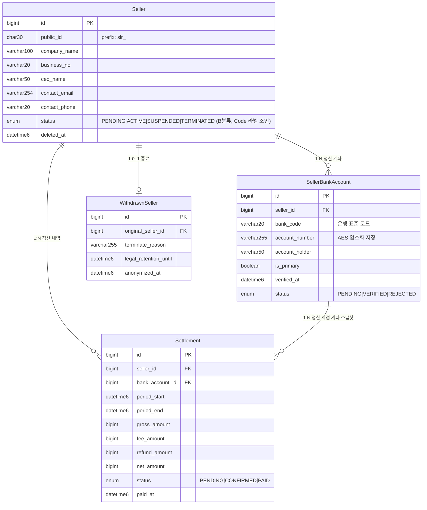

# 판매자 / 정산 ERD

> **소스**: db-schema-decisions.md v2.4 § 2.3 판매자

---

## Mermaid ERD

---

## 엔티티 요약

| 엔티티 | 역할 |
|---|---|
| Seller | 입점 판매자. 상태(status)는 Code 참조. 소프트 삭제 |
| SellerBankAccount | 정산 계좌. account_number AES 암호화. 계좌 변경 시 신규 row 추가 (이력 보존) |
| Settlement | 정산 내역. 정산 시점 계좌(bank_account_id) 스냅샷 고정. 금액 분해 구조 |
| WithdrawnSeller | 종료 판매자 아카이브. Seller TERMINATED 진입 시 행 생성. 법정 보관기간·비식별화 시점 관리(public_id 없음·ARCHIVE·D-23) |

---

## 도메인 간 연결

| 참조 방향 | 대상 도메인 | 비고 |
|---|---|---|
| Seller ← SellerUser.seller_id | [01-user-permission-grade](./01-user-permission-grade.md) | 판매자 내부 권한 관리 |
| Seller ← Product.seller_id | [03-product-inventory](./03-product-inventory.md) | 상품 등록 주체 |
| Seller ← OrderItem.seller_id | [04-order-payment-delivery-claim](./04-order-payment-delivery-claim.md) | 멀티벤더 정산 핵심 |
| Seller ← SellerSalesDaily.seller_id | [05-common-code-aggregate](./05-common-code-aggregate.md) | 일별 매출 집계 |

---

## 설계 메모

- **SellerBankAccount 별도 분리 이유**: 계좌번호 암호화(AES) 필요, 변경 이력 보존 필요, 실명확인(verified_at) 상태 관리 필요. Seller 테이블에 인라인 저장 시 이력 관리 불가.
- **계좌 변경 처리**: 신규 row 추가 + 기존 row `is_primary=false`. 삭제 없이 이력 보존. `is_primary=true`가 단 1개임을 애플리케이션 레이어에서 보장.
- **Settlement.bank_account_id 스냅샷**: 정산 집행 시점의 계좌를 고정. 이후 계좌 변경이 과거 정산 내역에 영향 없음.
- **금액 분해 구조**: `gross_amount - fee_amount - refund_amount = net_amount`. 각 항목을 개별 컬럼으로 분리하여 정산 검증 용이.
- **Seller.status Code 참조**: PENDING(심사중) → ACTIVE(활성) → SUSPENDED(정지) → TERMINATED(해지). 상태 전이 규칙은 코드 레이어 enum으로 관리 (CodeTransition 폐기).
- **public_id 부여**: Seller만 해당. SellerBankAccount, Settlement는 내부 BIGINT id.
- **enum 분류 (v2.3)**: Seller.status = B분류(ENUM + Code 라벨 조인)·SellerBankAccount.status·Settlement.status = A분류(잠금). 상세는 db-schema-decisions.md §1.13.
