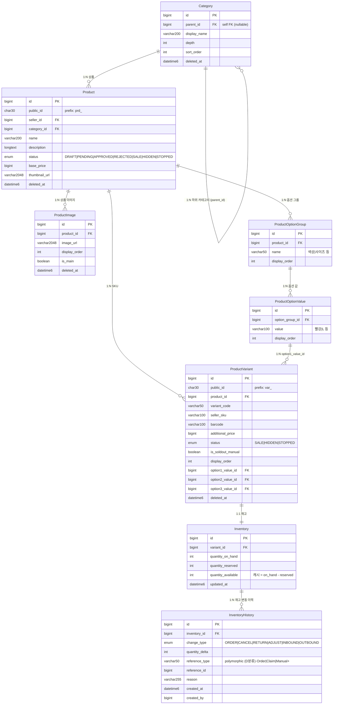

# 상품 / 재고 ERD

> **소스**: db-schema-decisions.md v2.4 § 2.4 상품·재고

---

## Mermaid ERD

---

## 엔티티 요약

| 엔티티 | 역할 |
|---|---|
| Category | 상품 분류 계층. parent_id self FK로 무한 depth 지원. 소프트 삭제 |
| Product | 상품 기본 정보. 판매자(seller_id) 소유. status로 진열 상태 관리 |
| ProductImage | 상품 이미지 전용. 다중·정렬·대표 이미지 지정 지원. Attachment와 분리 |
| ProductOptionGroup | 옵션 그룹 (색상, 사이즈 등). 상품당 최대 3개 (애플리케이션 제약) |
| ProductOptionValue | 옵션 그룹 내 값 (빨강, L 등). 표시 순서 관리 |
| ProductVariant | SKU 단위. option1~3_value_id 컬럼식 채택. 가격·상태 개별 관리 |
| Inventory | 실재고. variant 1:1. quantity_available 캐시 컬럼 보유 |
| InventoryHistory | 재고 변동 이력. append-only. 감사·재고 복구 기반 |

---

## 도메인 간 연결

| 참조 방향 | 대상 도메인 | 비고 |
|---|---|---|
| Product.seller_id → Seller.id | [02-seller-settlement](./02-seller-settlement.md) | 상품 등록 주체 |
| ProductVariant ← CartItem.variant_id | [04-order-payment-delivery-claim](./04-order-payment-delivery-claim.md) | 장바구니 SKU 참조 |
| ProductVariant ← OrderItem.variant_id | [04-order-payment-delivery-claim](./04-order-payment-delivery-claim.md) | 주문 SKU 스냅샷 |

---

## 설계 메모

- **Product vs ProductVariant 분리**: Product는 상품 메타(이름·설명·카테고리), ProductVariant는 SKU 단위 가격·재고·옵션. 상품 1개에 복수 SKU.
- **옵션 구조 컬럼식 채택**: `ProductVariantOptionValue` M:N 매핑 폐기. `option1_value_id / option2_value_id / option3_value_id` 3컬럼으로 고정. 한국 쇼핑몰 표준(최대 3개 옵션 그룹). JOIN 단순화.
- **UNIQUE 제약**: `(product_id, option1_value_id, option2_value_id, option3_value_id)` — 동일 옵션 조합 중복 방지. NULL 허용 컬럼 포함 복합 UNIQUE는 MariaDB에서 NULL != NULL이므로 애플리케이션 레이어 추가 검증 필요.
- **판매 가능 판정 3단계**: ① `status != SALE` → 비노출 ② `quantity_available <= 0` → 품절 ③ `is_soldout_manual = TRUE` → 운영자 강제 품절.
- **Inventory 분리 + 단일 창고 전제**: `warehouse_id` 제거. 단일 창고 전제로 단순화. 멀티 창고 도입 시 컬럼 추가 예정.
- **quantity_available 캐시**: `= quantity_on_hand - quantity_reserved`. **확정 (D-09)**: 애플리케이션 갱신. Inventory Aggregate 단일 진입점에서 재계산. DB 트리거 기각 (ADR-005·docs/domain/inventory-policy.md §5 참조).
- **ProductImage 전용 분리**: Attachment polymorphic에서 상품 이미지 제외(target_type에 PRODUCT 없음). 상품 이미지는 다중·정렬·대표 지정 등 전용 UX가 필요하여 전용 테이블 채택.
- **public_id 부여**: Product, ProductVariant만 해당. Category, ProductImage, ProductOptionGroup, ProductOptionValue, Inventory, InventoryHistory는 내부 BIGINT id.
- **enum 분류 (v2.3)**: Product.status·ProductVariant.status·InventoryHistory.change_type = A분류(잠금)·InventoryHistory.reference_type = D분류(polymorphic varchar). 상세는 db-schema-decisions.md §1.13.
