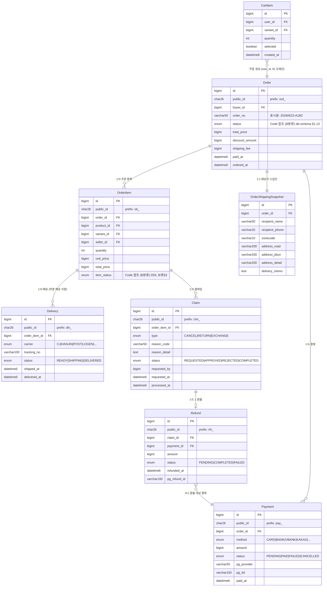

# 주문 / 결제 / 배송 / 클레임 ERD

> **소스**: db-schema-decisions.md v2.2 § 2.5 주문·결제·배송

---

## Mermaid ERD

---

## 엔티티 요약

| 엔티티 | 역할 |
|---|---|
| CartItem | 장바구니. Cart 헤더 없이 단일 테이블. UNIQUE(user_id, variant_id) |
| Order | 주문 헤더. 상태·총액·할인·배송비 집계 보유 |
| OrderItem | 주문 항목 (SKU 단위). seller_id 비정규화로 멀티벤더 정산 지원 |
| OrderShippingSnapshot | 주문 시점 배송지 고정. UserAddress 변경과 독립 |
| Payment | 결제 건. PG 정보(pg_provider, pg_tid) 보유. 복수 결제 지원 |
| Delivery | 배송 건. OrderItem 단위로 부분 배송 지원 |
| Claim | 취소/반품/교환 요청. 요청(Claim) ↔ 처리(Refund) 분리 |
| Refund | 환불 처리 결과. Payment 역참조로 PG 환불 대사 |

---

## 도메인 간 연결

| 참조 방향 | 대상 도메인 | 비고 |
|---|---|---|
| CartItem.user_id → User.id | [01-user-permission-grade](./01-user-permission-grade.md) | 장바구니 소유자 |
| CartItem.variant_id → ProductVariant.id | [03-product-inventory](./03-product-inventory.md) | 장바구니 SKU 참조 |
| Order.buyer_id → User.id | [01-user-permission-grade](./01-user-permission-grade.md) | 주문자 |
| OrderItem.variant_id → ProductVariant.id | [03-product-inventory](./03-product-inventory.md) | 주문 SKU (재고 차감 기준) |
| OrderItem.seller_id → Seller.id | [02-seller-settlement](./02-seller-settlement.md) | 멀티벤더 정산 핵심 (의도된 비정규화) |
| Order.status Code 참조 | [05-common-code-aggregate](./05-common-code-aggregate.md) | CodeGroup: ORDER_STATUS |

---

## 설계 메모

- **CartItem 단일 테이블**: `Cart` 헤더 제거. 장바구니 = CartItem 목록. UNIQUE `(user_id, variant_id)`. 다중 카트(위시리스트·정기구독) 도입 시 `cart_id` 컬럼 추가.
- **OrderItem.seller_id 비정규화**: `Product.seller_id`와 중복이지만 의도된 설계. 멀티벤더 정산 시 OrderItem 단위로 seller_id 직접 참조 필요. 주문 당시 판매자 관계 고정.
- **OrderShippingSnapshot**: 주문 시점 배송지 시점 스냅샷. UserAddress 변경·삭제 무관하게 주문 데이터 정합성 보존. Order와 1:1.
- **Delivery는 OrderItem 단위**: 동일 주문의 상품별 배송사·운송장이 다를 수 있음 (부분 배송). OrderItem 1:N Delivery.
- **Order.status vs OrderItem.item_status 이중 관리**: Order 전체 상태와 항목별 상태를 분리 관리. 동기화 규칙은 DDL 작성 전 결정 보류 ([README 결정 보류 항목](./README.md) 참조).
- **Claim(요청) → Refund(처리) 분리**: 클레임 승인 후 환불 처리는 별도 행. Claim은 요청·승인·거절 이력, Refund는 PG 실환불 결과 기록.
- **Payment.pg_tid로 환불 대사**: Refund는 payment_id로 어떤 결제 건의 환불인지 추적. PG 환불 ID(pg_refund_id)로 외부 대사 가능.
- **소프트 삭제 미적용**: Order, OrderItem, Payment, Delivery, Claim, Refund는 상태(status) 관리. "삭제"가 아닌 "상태 전이"로 처리.
- **public_id 부여**: Order(ord_), OrderItem(oit_), Payment(pay_), Delivery(dlv_), Claim(clm_), Refund(rfn_). CartItem, OrderShippingSnapshot은 BIGINT id.
- **enum 분류 (v2.3)**: Order.status·OrderItem.item_status = B분류·Payment/Delivery/Claim/Refund의 type·status·method·carrier 9건 = A분류. 상세는 db-schema-decisions.md §1.13.
