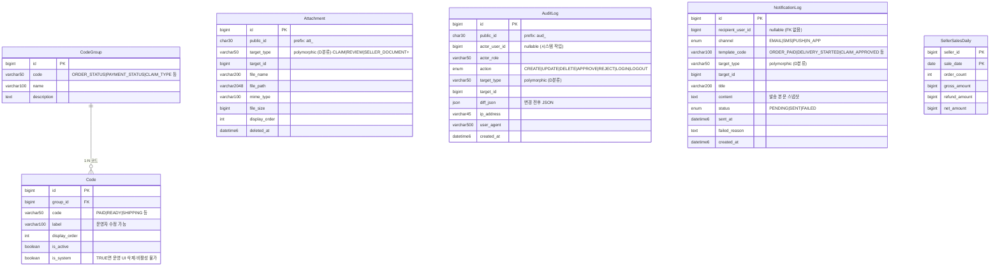

# 코드 / 공통 / 집계 ERD

> **소스**: db-schema-decisions.md v2.4 § 2.6 코드·상태 관리, § 2.7 공통, § 2.8 집계

---

## Mermaid ERD

---

## 엔티티 요약

| 엔티티 | 역할 |
|---|---|
| CodeGroup | 코드 그룹 마스터 (ORDER_STATUS, PAYMENT_STATUS 등) |
| Code | 코드 값. label·display_order·is_active 운영자 편집 가능. is_system=true 보호 |
| Attachment | 비정형 첨부파일 polymorphic. PRODUCT 제외 (ProductImage 전용 분리) |
| AuditLog | 전체 도메인 감사 로그. FK 없음. append-only. diff_json 변경 추적 |
| NotificationLog | 알림 발송 이력. FK 없음. 발송 본문 스냅샷 보존 |
| SellerSalesDaily | 판매자 일별 매출 집계. 복합 PK (seller_id, sale_date) |

---

## 도메인 간 연결

| 참조 방향 | 대상 도메인 | 비고 |
|---|---|---|
| Code ← Order.status | [04-order-payment-delivery-claim](./04-order-payment-delivery-claim.md) | ORDER_STATUS 그룹 Code 참조 |
| Code ← OrderItem.item_status | [04-order-payment-delivery-claim](./04-order-payment-delivery-claim.md) | ORDER_ITEM_STATUS 그룹 Code 참조 |
| Code ← Claim.reason_code | [04-order-payment-delivery-claim](./04-order-payment-delivery-claim.md) | CLAIM_REASON 그룹 Code 참조 |
| Code ← Seller.status | [02-seller-settlement](./02-seller-settlement.md) | SELLER_STATUS 그룹 Code 참조 |
| AuditLog.target_type → 모든 도메인 | 전체 | polymorphic, FK 없음 |
| NotificationLog.target_type → 모든 도메인 | 전체 | polymorphic, FK 없음 |
| SellerSalesDaily.seller_id → Seller.id | [02-seller-settlement](./02-seller-settlement.md) | 논리적 참조, FK 적용 검토 |

---

## 설계 메모

- **Code/CodeGroup 운영자 편집 범위**: `label`(표시명), `display_order`(정렬), `is_active`(활성) 수정 가능. 코드 값(`code`)과 상태 전이 규칙 자체는 코드 레이어 enum으로 고정 (배포로만 변경).
- **CodeTransition 폐기**: 상태 전이 규칙을 DB 테이블로 관리하던 방식 제거. Java enum + `canTransitionTo(from, to, role)` Service 메서드로 대체.
- **Code.is_system=true 보호**: 시스템 의존 코드(PAID, CANCELLED 등)는 운영 UI에서 삭제·비활성화 불가. 코드 단계에서 필터링.
- **Code.color 제거**: 상태 색상 표시는 디자인 시스템 영역. DB 컬럼 보유 불필요.
- **Attachment polymorphic 범위**: CLAIM, REVIEW, SELLER_DOCUMENT 등 비정형 첨부. **PRODUCT 제외** — 상품 이미지는 ProductImage 전용 테이블 사용.
- **AuditLog FK 없음**: actor_user_id, target_id 모두 논리적 참조만. 비식별화 후에도 로그 정합성 유지 (user_id 유지, 개인정보 null). append-only, 수정·삭제 없음.
- **AuditLog.diff_json 타입**: **확정 (D-11)**: JSON 타입. MariaDB JSON = LONGTEXT + CHECK 제약 alias. JSON 경로 함수(`JSON_EXTRACT`) 지원·유효성 검증 CHECK 자동 적용 (docs/architecture-baseline/audit-policy.md·ADR-006 참조).
- **NotificationLog 분류 (D-18)**: NotificationLog = Infra/Event Processing (이벤트 소비 기록·Aggregate 아님). 16 Aggregate + 1 Infra/Event Processing 구조 (docs/architecture-baseline/aggregate-boundary.md §2.7 참조).
- **NotificationLog 1차 범위**: 발송 이력만. `recipient_user_id` FK 없음 (시스템 발송·비식별화 유저 발송 허용). 발송 트리거·재시도·템플릿 관리는 2차 도입.
- **SellerSalesMonthly 폐기**: 월간 집계는 `vw_seller_sales_monthly` VIEW로 즉시 집계. `SellerSalesDaily` 30개 GROUP BY는 MariaDB에서 부하 없음.
- **public_id 부여**: Attachment(att_), AuditLog만 해당. CodeGroup, Code, NotificationLog, SellerSalesDaily는 내부 id.
- **enum 분류 (v2.3)**: AuditLog.action·NotificationLog.channel·NotificationLog.status = A분류·Attachment/AuditLog/NotificationLog의 target_type = D분류(polymorphic varchar). 상세는 db-schema-decisions.md §1.13.
